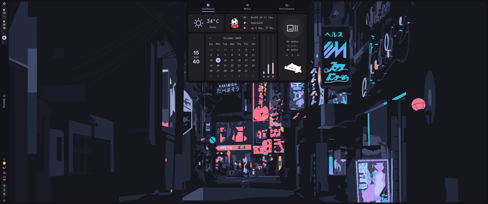
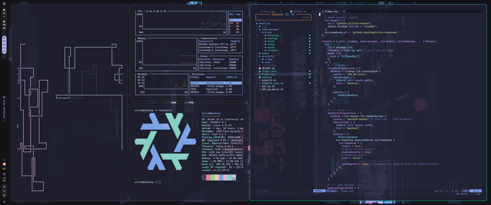

## My nixos configure

### 🖼️ Gallery




## Overview

### Layout

- [flake.nix](flake.nix) base of the configuration
- [hosts](hosts) per-host configurations that contain machine specific configurations
  - [desktop](hosts/desktop/) 🖥️ Desktop specific configuration
  - [desktop](hosts/macbook/) 🖥️ MacOs specific configuration
- [home-manager](home-manager)
  - [users]() per-user configuration with .config and apps

## 📓 Components
|                             | Nixos + Hyprland     |
| --------------------------- | :--------------------:
| **Window Manager**          | [Hyprland](https://github.com/hyprwm/Hyprland) |
| **File Manager**            | [yazi](https://github.com/sxyazi/yazi)     |
| **Shell**                   | [fish](https://github.com/fish-shell/fish-shell)         |
| **Beauty**                  | [caelestia-shell](https://github.com/caelestia-dots/caelestia)     |
| **Sddm**                    | [sddm-astronaut](https://github.com/Keyitdev/sddm-astronaut-theme)     |

## Easy to use

```bash
git clone https://github.com/Linermao/dotfiles.git dotfiles
cd dotfiles

# for empty nixos machine
# !!!! this will remove all datas on machine !!!!
./set_up.sh
# for macOS
./set_up_macos.sh

# rebuild system
./rebuild.sh
# rebuild home-manager
./rebuild_user.sh
```