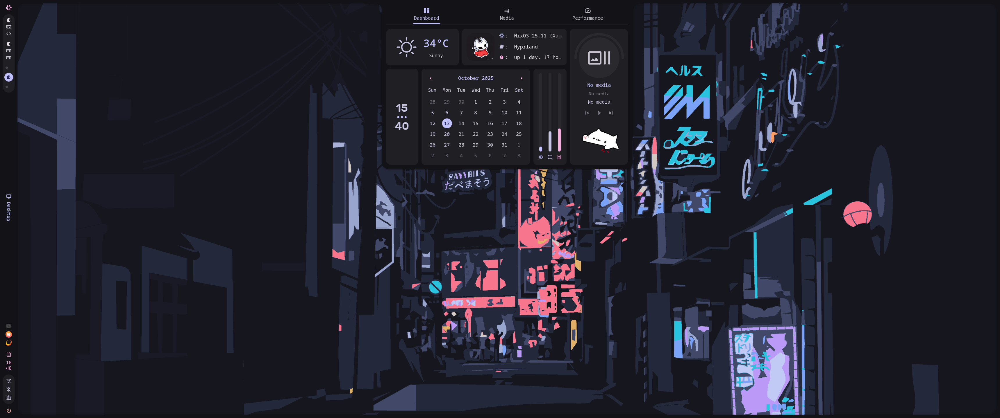
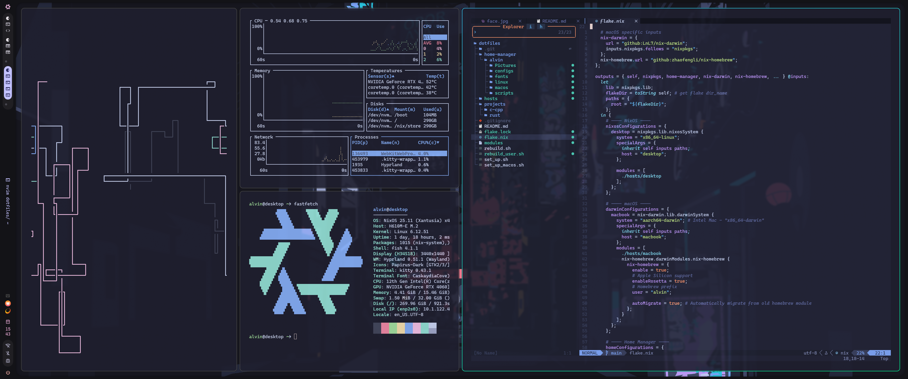

## My nixos configure

### 🖼️ Gallery




## Overview

### Layout

- [flake.nix](flake.nix) entrypoint that auto-generates system and Home Manager outputs from `hosts/` and `users/`
- [hosts](hosts) per-host definitions
  - each host lives in its own directory
  - `meta.nix` defines host type, system, hostname, and module list
  - `hardware-configuration.nix` is kept only for NixOS hosts when needed
- [modules](modules) reusable modules grouped by `system` and `home-manager`
- [users](users) per-user definitions
  - each user lives in its own directory
  - `meta.nix` defines which hosts the user belongs to
  - `system/` contains system-level user declarations
  - `home/` contains Home Manager definitions for NixOS and macOS
- [assets](assets) static files deployed by Home Manager, such as configs, scripts, wallpapers, fonts, and avatars

## Add a Host

Create a new directory under `hosts/<name>/`.

For a NixOS host:

1. Add `hosts/<name>/meta.nix`
2. Add `hosts/<name>/hardware-configuration.nix` if the machine needs one
3. Define `type = "nixos"`, `system`, `hostName`, and the `modules` list in `meta.nix`

Example:

```nix
{ ... }:

{
  type = "nixos";
  system = "x86_64-linux";
  hostName = "desktop";

  modules = [
    ./hardware-configuration.nix
    ../../modules/system/nixos/base.nix
    ../../modules/system/nixos/system.nix
  ];
}
```

For a macOS host:

1. Add `hosts/<name>/meta.nix`
2. Define `type = "macos"`, `system`, `hostName`, and the `modules` list

Example:

```nix
{ inputs, primaryMacosUser, ... }:

{
  type = "macos";
  system = "aarch64-darwin";
  hostName = "macbook";

  modules = [
    ../../modules/system/macos/base.nix
    ../../modules/system/macos/desktop.nix
    ../../modules/system/macos/nix.nix
    ../../modules/system/macos/system.nix
    ../../modules/system/macos/users.nix
    ../../modules/system/macos/homebrew.nix
    inputs.nix-homebrew.darwinModules.nix-homebrew
    {
      nix-homebrew = {
        enable = true;
        enableRosetta = true;
        user = primaryMacosUser;
        autoMigrate = true;
      };
    }
  ];
}
```

`flake.nix` will automatically expose the new host as a system output using the directory name.

## Add a User

Create a new directory under `users/<name>/`.

Each user directory should contain:

1. `meta.nix`
2. `system/nixos.nix`
3. `system/macos.nix`
4. `home/nixos.nix`
5. `home/macos.nix`

Example `users/<name>/meta.nix`:

```nix
{
  nixosHosts = [ "desktop" ];
  macosHosts = [ "macbook" ];
  primaryMacosHosts = [ "macbook" ];
}
```

Once those files exist, `flake.nix` will automatically:

- include the user in system-level user aggregation for matching hosts
- generate the matching Home Manager outputs such as `<user>@desktop` or `<user>@macbook`

## Components
|                             | Nixos + Hyprland     |
| --------------------------- | :--------------------:
| **Window Manager**          | [Hyprland](https://github.com/hyprwm/Hyprland) |
| **File Manager**            | [yazi](https://github.com/sxyazi/yazi)     |
| **Shell**                   | [fish](https://github.com/fish-shell/fish-shell)         |
| **Beauty**                  | [caelestia-shell](https://github.com/caelestia-dots/caelestia)     |
| **Sddm**                    | [sddm-astronaut](https://github.com/Keyitdev/sddm-astronaut-theme)     |

## Usage

### Install

```bash
git clone https://github.com/Linermao/dotfiles.git dotfiles
cd dotfiles

# inspect available install targets
./install_nixos.sh --list-hosts
./install_macos.sh --list-hosts

# destructive: wipe the whole target disk and recreate the layout
./install_nixos.sh --mode fresh --host desktop --device /dev/nvme0n1

# safer: reuse an existing EFI/root/swap layout
./install_nixos.sh --mode existing --host desktop \
  --efi /dev/nvme0n1p1 \
  --root /dev/nvme0n1p2 \
  --swap /dev/nvme0n1p3

# macOS bootstrap
./install_macos.sh --host macbook
```

NixOS install modes:

- `fresh`
  Use this for a clean machine or a full reinstall. It wipes the whole disk, recreates partitions, formats filesystems, generates `hosts/<name>/hardware-configuration.nix`, copies this repo into the target system, and can run `nixos-install`.
- `existing`
  Use this when you want to keep an existing partition layout, such as dual-boot or a manually prepared disk. It reuses the EFI/root/swap partitions you specify, can optionally format only those partitions, then generates `hosts/<name>/hardware-configuration.nix` and can run `nixos-install`.

`hosts/*/hardware-configuration.nix` is treated as host-local state:

- it is generated or refreshed by the installer
- it is ignored by git
- rebuilds should keep using path-based flakes so the local file is visible

First boot note for NixOS:

- after `nixos-install`, only the system-side setup is complete
- the repository is copied into `/nixos`
- desktop sessions like Hyprland are still provided by Home Manager
- on the first boot, switch to a TTY such as `Ctrl+Alt+F3`, log in there, run `/nixos/rebuild_user.sh`, and reboot once more before expecting SDDM to launch the final desktop session correctly

### Rebuild

```bash
# inspect available targets
./rebuild.sh --list
./rebuild_user.sh --list

# interactive selection
./rebuild.sh
./rebuild_user.sh

# explicit commands
./rebuild.sh desktop switch
./rebuild.sh desktop test
./rebuild_user.sh alvin desktop switch
./rebuild_user.sh alvin desktop build
```

### Verify

```bash
# verify flake outputs
nix eval "path:$PWD#nixosConfigurations.desktop.config.networking.hostName"
nix eval "path:$PWD#homeConfigurations.\"alvin@desktop\".config.home.username"

# verify the active system after a successful switch
readlink -f /run/current-system
```
